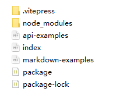

# 1.准备工作

下载安装

**vsCode**

**node**

**npm(node.js 自带)**

**pnpm(cmd 中进行安装 看 node 中相关安装介绍)**

# 2.相关文档说明

官方文档

https://vitepress.dev/zh/guide/what-is-vitepress

哔站解说

https://www.bilibili.com/video/BV1j26tY2EHL?spm_id_from=333.788.videopod.sections&vd_source=8d344b6165c945a4199a6a522bba4f48

**VitePress** 是 Vue 团队官方推出的新一代静态站点生成器（Static Site Generator, SSG），基于 **Vite** 构建，专为快速、简单的文档网站开发而设计。它的核心作用是**将 Markdown 文件转换为高性能的静态 HTML 页面**，同时提供现代化的开发体验和丰富的主题定制能力

# 3.初步流程

## 建议

为了避免偶然间触发一些问题而你无法解决，请尽量避免使用包含中文文字、表情符号或空格的文件路径 (如: `C:\Users\鲁迅\Desktop\VuePress 项目\Hope 主题❤️\`)。

建议使用纯英文路径 (如: `D:\projects\vuepress-theme-hope\`)。

(尤弥尔说明文档为例)

## 步骤

1.选好路径，建立一个用来存放的文件夹 G:\readme-document\rd-Yirm

2.点击文件夹进入，点击路径，输入 cmd 进入

3.利用 npm 进行添加

```cmd
npm add -D vitepress

# 将 vitepress 作为开发依赖（devDependency）安装到当前项目的 node_modules 目录中，并记录到 package.json 文件的 devDependencies 字段中。

# 运行成功后 rd-Yirm 原本空文件下出现了以下文件
# node_modules  package.json  package.json
```

4.构建一个基本项目 输入

```cmd
npx vitepress init
```

回答以下几个问题

```cmd
 Where should VitePress initialize the config?
 # 初始化配置放在哪个目录下
# 正常默认不修改 按回车

 Site title:
 # 站点的title是什么
 # 默认按回车

 Site description:
 # 站点描述
 # 默认回车

 Theme:
 # 主题是什么
 # 回车默认

 Use TypeScript for config and theme files?
 # 是否用ts写
 # no

 Add VitePress npm scripts to package.json?
 # 是否把npm脚本卸载该json中
 # yes

```

至此，目录下出现了一些初始文件和配置



然后可以用 vscode 进行打开

# 4.相关开发

## 4.1 package.json 中配置

package.json 中主要就是一些依赖管理的配置

### 1.**启动命令 "docs:dev"**

在终端中输入 以下命令进行启动

```cmd
npm run docs:dev

# 当然我们可以把package.json中的scriptes中的docs:删除 这样输入npm指令的时候就是 npm run dev 要简单一些
```

如果输入之后可能报错

```error
npm : 无法加载文件 D:\node\node-v22.17.0-win-x64\npm.ps1，因为在此系统上禁止运行脚本。有关详细信息，请参阅 https:/go.microsoft.c
om/fwlink/?LinkID=135170 中的 about_Execution_Policies。
所在位置 行:1 字符: 1
+ npm run docs:dev
+ ~~~
    + CategoryInfo          : SecurityError: (:) []，PSSecurityException
    + FullyQualifiedErrorId : UnauthorizedAccess
```

这是因为**Windows PowerShell 的执行策略（Execution Policy）限制了脚本的运行**，导致无法直接执行 `npm` 命令

**解决办法：**
win+x 点击 PowerShell （管理员）
输入指令：**Set-ExecutionPolicy RemoteSigned** 永久修改全局执行策略

之后重新输入指令，会弹出一个网站，ctrl+点击打开可以进入

同时还在项目中生成了一个缓存 cache

**我们后面该配置就在 config.mjs 中修改**

## 4.2 index.md

这个里面对应着进入首页的页面显示，可以手动输入然后修改下即刻了解

如果想多加一个 action 那么在 md 中进行添加

```md
actions: - theme: alt
text: 测试
link: /新 md 的路径

      注意 缩进也要一样
```

## 4.3 config.mjs

### 1.自己配置文档路径

在原本框架中 根目录下存在几个 md 文档，比如 index/markdown-examples/api-examples,比较琐碎，

我们可以新建一个文件夹 docs 拿来放这些文档

光这样的话会报错 404 ，所以我们需要再 config.mjs 中进行配置
defineConfig 中与 themeConfig 同级

```js
srcDir: "docs";
```

### 2.上次更新时间（未测试）

export default 下的 themeConfig 配置

```js
export default {
  themeConfig: {
    lastUpdated: {
      text: "更新时间",
      formatOptions: {
        dateStyle: "full",
        timeStyle: "medium", // 时间显示 medium 有秒 short 没秒
      },
    },
  },
};
```

export default 下配置

```js
lastUpdated: true,
```

注意 这个需要搭配 git 使用 ，时间以上次更新到 git 上的时间为主（还在测试）

### 3.图标配置

在 export default 下进行配置 head

```js
head:[["link",{rel:"icon",href:"/favicon.ico"}]],

// 可以在docs下新建一个pubilc文件夹 一般会把这个public文件夹默认为根目录
// 里面放置了名为 favicon.ico 的图标
```

### 4.链接跳转

就是在右上角的可以跳转的链接 一般可以用来放置 github，但是我们只是作为说明文档，没有必要跳转，那就不放这个，如果要放那么尽兴配置

themeConfig 中的配置

```js
socialLinks: [
      { icon: "github", link: "https://github.com/vuejs/vitepress" },
    ],

// icon 这个可以去incofont中找一个，找到之后点击下载，点击复制svg代码 放在icon中 {icon:'复制的svg代码'}
// link 就是跳转的链接
```

### 5.页脚生成

在 themeConfig 中进行配置 这个作说明文档配不配都行

```js
themeConfig: {
    footer: {
      message: 'Released under the MIT License.',
      copyright: 'Copyright © 2019-present Evan You' // 版权备案号
    }
  }
```

### 6.上一页下一页中文

可用于自定义出现在上一页和下一页链接上方的文本。如果不是用英语编写文档，这很有帮助

```js
export default {
  themeConfig: {
    docFooter: {
      prev: "上一页",
      next: "下一页",
    },
  },
};
```

### 7.主页 title 添加图片

themeConfig 下添加配置 这个图片一样放在 public 中

```js
logo: "/logo.png",
```

### 8.中文修改

比如鼠标悬停到切换主题那原本有中文输出 themeConfig 进行配置修改

```js
    sidebarMenuLabel: "菜单",
    returnToTopLabel: "返回顶部",
    darkModeSwitchLabel: "外观",
    lightModeSwitchTitle: "切换到浅色模式",
    darkModeSwitchTitle: "切换到深色模式",
    outline: {
      label: "页面导航",
      level: "deep",
    },

```

### 9.搜索

themeConfig 下进行配置

```js
 search: {
      provider: "local", // 提供者
      options: {
        translations: {
          // 搜索按钮
          button: {
            buttonText: "搜索文档",
            buttonAriaLabel: "搜索文档",
          },
          // 模式
          modal: {
            noResultsText: "无法找到相关结果",
            resetButtonTitle: "清除查询条件",
            footer: {
              selectText: "选择",
              navigateText: "切换",
              closeText: "关闭",
            },
          },
        },
      },
    },
```

## 4.4 将 config.mjs 中引用文档路径单放

​ 在 config.mjs 中的 nav 以及 sidebar 包含了需要用到的文档，我们可以把它单独提取出来放置，不在这里面浪费空间

​ 在 config.mjs 同目录下创建两个 mjs（nav.mjs sidebar.mjs）**`.mjs`**：使用 `import` 和 `export` 语法导入/导出模块。

**nav.mjs 中**

```js
export default [
  { text: "首页", link: "/" },
  { text: "例子", link: "/markdown-examples" },
  // 之后可以自己添加
];
```

**sidebar.mjs 中**

```js
export default [
  {
    text: "Examples",
    items: [
      { text: "Markdown Examples", link: "/markdown-examples" },
      { text: "Runtime API Examples", link: "/api-examples" },
    ],
  },
];
```

**在 config.mjs 中要进行引入**

```js
import nav from "./nav.mjs";
import sidebar from "./sidebar.mjs";

...
nav: nav,
sidebar: sidebar,
...
```
